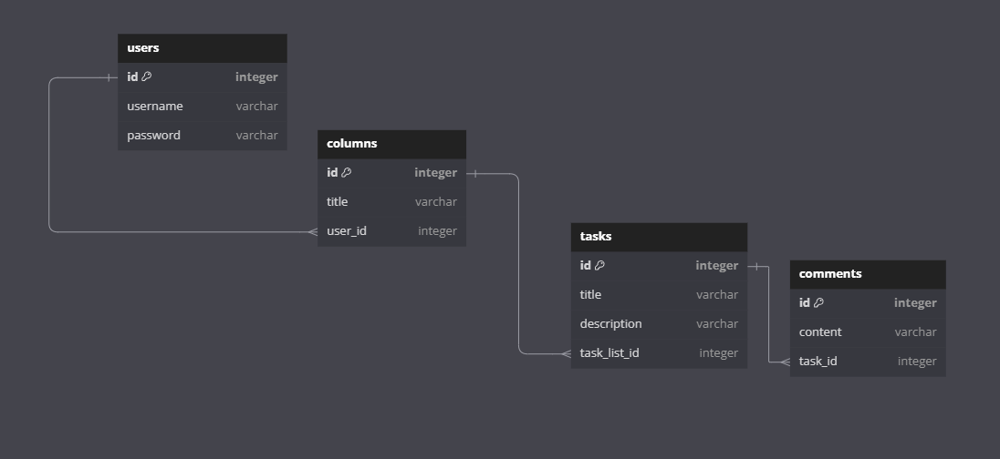

# Trello
Use following command to run server:
```sh
npm run start
```
## Project folder structure
```js
+-- dist
+-- public
+-- src
|   +-- auth
|   +-- columns
|   |   +-- dto
|   |   +-- entities
|   +-- comments
|   |   +-- dto
|   |   +-- entities
|   +-- exception
|   +-- guards
|   +-- pipes
|   +-- tasks
|   |   +-- dto
|   |   +-- entities
|   +-- users
|   |   +-- dto
|   |   +-- entities
|   +-- common
```
## Database structure
Source link - https://dbdiagram.io/d/Trello-66bdde248b4bb5230e32eea6
